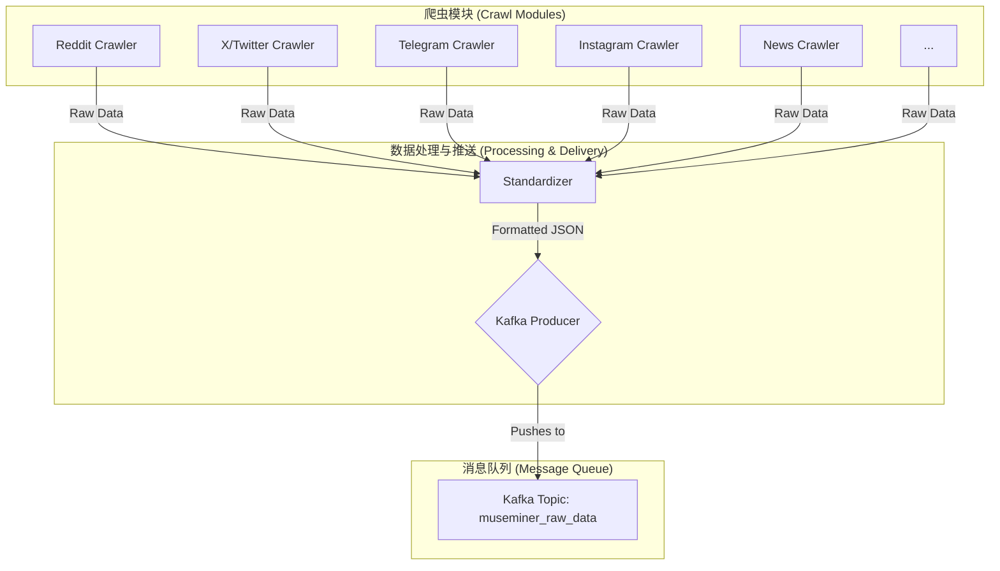

# MuseMiner 数据采集项目实施文档

## 1. 概述

本文档旨在为 `crawl4ai` 项目提供一个清晰的实施路线图，以满足 [MuseMiner 项目数据采集需求文档 (V2)](./数据采集需求文档.md) 中定义的需求。

项目核心目标是构建一个稳定、高效的数据采集系统，专注于从公众社交平台和“数字战壕”等渠道获取原始、未经加工的数据，并将其统一推送到 Kafka 消息队列中。

### 1.1. 技术栈

- **数据管道:** Kafka (`museminer_raw_data` 主题)
- **HTTP 请求:** `httpx`
- **HTML 解析:** `BeautifulSoup4`
- **RSS 解析:** `feedparser`
- **Telegram:** `Telethon`
- **付费抓取服务:** `Apify` (用于 X/Twitter, TikTok, Snapchat)
- **Instagram:** `instaloader`
- **部署:** Docker (暂定)

## 2. 系统架构

系统将采用模块化设计，每个数据源对应一个独立的爬虫模块。所有模块将采集到的数据格式化为标准 JSON，并通过统一的生产者模块推送到 Kafka。



## 3. 爬虫模块实施详情

### 3.1. 第一优先级：公众舆论场

#### 3.1.1. Reddit

- **技术:** `httpx`
- **策略:**
    1. 直接请求目标 Subreddit 的 `.json` 接口 (例如 `https://www.reddit.com/r/worldnews.json`)。
    2. 遍历返回 JSON 中的 `children` 列表，提取每篇帖子的数据。
    3. 将帖子数据映射到附录 A 的标准 JSON Schema。
    4. **注意:** `content` 字段应包含帖子正文和热门评论。`metadata.reddit_score` 记录帖子得分。

#### 3.1.2. X (Twitter)

- **技术:** `Apify`
- **策略:**
    1. 订阅 Apify 提供的 Twitter Scraper Actor。
    2. 配置 Actor 以监控特定的 Hashtag 或用户列表。
    3. 通过 Apify API Webhook 或定时轮询获取抓取结果。
    4. 将 Apify 返回的数据转换为标准 JSON 格式。`metadata.tweet_id` 必须记录。

#### 31.3. TikTok & Instagram

- **技术:** `Apify` (TikTok), `instaloader` (Instagram)
- **策略:**
    - **TikTok:** 与 X 类似，使用 Apify 的 TikTok Scraper Actor，配置监控 Hashtag。
    - **Instagram:** 使用 `instaloader` 库，登录账户后抓取指定公民记者的帖子和故事。需要处理登录状态和会话持久化。

### 3.2. 第二优先级：数字战壕

#### 3.2.1. Telegram

- **技术:** `Telethon`
- **策略:**
    1. 创建一个 Telegram 应用以获取 `api_id` 和 `api_hash`。
    2. 使用 `Telethon` 客户端连接到 Telegram。
    3. 加入需求文档中指定的频道 (Gaza Now, Abu Ali Express 等)。
    4. 监听新消息事件 (`events.NewMessage`)。
    5. 将收到的消息对象 (`Message`) 转换为标准 JSON 格式。
    6. **重点:** `content` 字段需包含消息全文。如果消息包含图片或视频，其 URL 或本地缓存路径应记录在 `media_urls` 中。**翻译将在消费端处理，本阶段只负责抓取原文。**

#### 3.2.2. Reddit (`r/CombatFootage`)

- **技术:** `httpx`
- **策略:** 与 3.1.1. Reddit 爬虫相同。

### 3.3. 第三优先级：背景与事实参考

#### 3.3.1. RSS 源 (路透社, 美联社, Hacker News)

- **技术:** `feedparser`
- **策略:**
    1. 使用 `feedparser.parse()` 读取 RSS URL。
    2. 遍历 `entries` 列表，提取文章标题、链接、发布时间等信息。
    3. `content` 字段应为文章摘要或全文（如果 RSS 提供）。

#### 3.3.2. AllSides

- **技术:** `httpx` + `BeautifulSoup4`
- **策略:**
    1. 抓取 AllSides 主页或特定新闻主题页面。
    2. 使用 `BeautifulSoup4` 解析 HTML，定位不同立场（左、中、右）的新闻标题和链接。
    3. 将同一事件的不同报道打包或分别发送。

## 4. 数据格式 (JSON Schema)

所有爬虫模块必须输出符合以下结构的数据。这是确保下游消费者能统一处理数据的关键。

```json
{
  "id": "string", // 唯一标识符 (建议: source_name + hash(url))
  "source_category": "string", // e.g., "Social Media", "Digital Trenches", "News"
  "source_name": "string", // e.g., "Reddit r/worldnews", "Telegram Gaza Now"
  "url": "string", // 原始链接
  "title": "string | null", // 帖子或文章标题
  "content": "string", // 正文内容
  "author": "string | null", // 作者用户名
  "published_at": "string", // ISO 8601 格式
  "scraped_at": "string", // ISO 8601 格式
  "media_urls": ["string"], // 关联的图片/视频链接
  "metadata": {
    "reddit_score": "integer | null",
    "tweet_id": "string | null",
    "replies_count": "integer | null",
    "language": "string" // 原始语言代码 (e.g., "en", "ar")
  }
}
```

## 5. 部署与监控

- **部署:**
    - 每个爬虫模块将被容器化 (Docker)。
    - 使用 `docker-compose` 或 Kubernetes 进行编排。
    - 敏感信息 (API 密钥, 登录凭证) 将通过环境变量或 Secrets Management 工具注入。
- **监控:**
    - **日志:** 所有模块应产生结构化日志，记录抓取活动、成功、失败和异常。
    - **心跳:** 每个爬虫应定期向一个专门的监控端点或 Kafka 主题发送心跳消息，以表明其存活状态。
    - **异常处理:** 必须实现健壮的重试机制（特别是针对网络请求）和错误上报（例如到 Sentry 或一个专门的 Slack 频道）。
